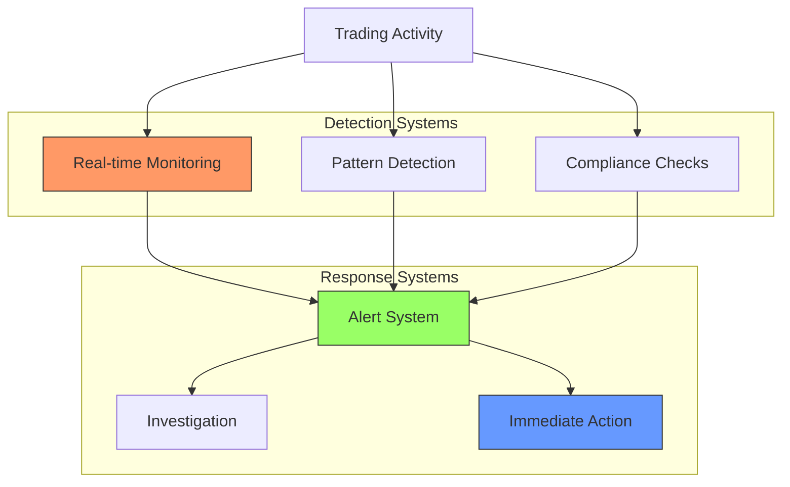

# 1.2.5 Market Surveillance and Compliance



Think of market surveillance like a sophisticated security system in a large shopping mall. Just as the mall uses cameras, security guards, and electronic tags to prevent theft and ensure safety, markets use advanced systems to monitor trading and ensure fair play.

Let's break down how market surveillance works in practice, using clear examples:

1. **Real-time Monitoring**

Imagine you're watching security cameras in a mall. Similarly, market surveillance systems monitor trading activity in real-time. Let's see an example:

Normal Trading Pattern:

```
Time    Price    Volume    Traders
09:00   50,000   1.2 BTC   A buys from B
09:05   50,100   0.8 BTC   C sells to D
09:10   50,050   1.0 BTC   E buys from F
```

Suspicious Pattern:

```
Time    Price    Volume    Traders
09:00   50,000   1.2 BTC   A buys from B
09:01   50,000   1.2 BTC   B buys from A
09:02   50,000   1.2 BTC   A buys from B
```

The system detects:

* Same parties trading repeatedly
* No net position change
* Unusual timing patterns This might indicate wash trading (trading with yourself to create false volume).

2. **Pattern Detection**

Like facial recognition in security cameras, market surveillance uses pattern recognition to spot potential manipulation. Here's how it works:

Spoofing Detection Example:

```
Order Book State:
Sell Orders:
50,200: 10 BTC
50,100: 5 BTC
50,050: 2 BTC

Suspicious Activity:
1. Large buy order placed at 50,000 (20 BTC)
2. Smaller sells execute at 50,050
3. Large buy order cancelled immediately

Pattern Identified:
- Large order placed away from market
- Other traders react to order
- Quick cancellation
- Pattern repeats
```

3. **Compliance Monitoring**

Think of this like checking IDs at the mall entrance. The system verifies that traders and trades meet all regulatory requirements:

Trading Limits Check:

```
Trader Position Limits:
Maximum Position: 100 BTC
Current Position: 90 BTC

Trade Attempt: Buy 15 BTC
System Response: 
- Flags trade as potential limit violation
- Requires compliance review
- May block trade automatically
```

4. **Alert System**

When suspicious activity is detected, the system generates alerts based on severity:

Alert Levels:

```
Level 1 (Information):
- Unusual trading volume
- New trading patterns
Action: Log for review

Level 2 (Warning):
- Potential wash trading
- Position limit approaches
Action: Alert compliance team

Level 3 (Critical):
- Clear manipulation pattern
- Serious rule violations
Action: 
- Immediate trading suspension
- Regulatory notification
```

5. **Investigation Process**

When suspicious activity is detected, a structured investigation follows:

Example Investigation Flow:

```
1. Initial Alert:
   - Unusual price movement in BTC/USD
   - 20% price spike in 5 minutes
   - High volume from few accounts

2. Data Gathering:
   - Order book snapshots
   - Trade records
   - Communication records
   - Related account activity

3. Pattern Analysis:
   - Compare to known manipulation patterns
   - Check for coordinated trading
   - Review historical behavior

4. Action Determination:
   - Warning notice
   - Trading suspension
   - Regulatory referral
```

The surveillance system continuously adapts and learns:

* Updates pattern recognition rules
* Adjusts alert thresholds
* Incorporates new manipulation techniques
* Refines detection accuracy

***


Traditional markets evolved sophisticated surveillance and compliance systems to ensure fair trading and protect participants. However, in 2009, a radically different vision emerged - one that asked: What if we could create markets that enforce rules through code rather than institutions? What if trust could be programmatic rather than organizational?

This was the revolutionary idea behind Bitcoin and the rise of cryptocurrency trading. Rather than relying on centralized authorities to monitor and enforce rules, these new markets would use blockchain technology and smart contracts to create transparent, programmatically-enforced trading environments. The immutable nature of blockchain transactions offered a fundamentally different approach to ensuring market integrity.

This shift from institutional oversight to cryptographic guarantees marked the beginning of a new chapter in financial markets - one where decentralization and code-based trust would challenge traditional market structures. Let's explore how this cryptocurrency revolution began and how it transformed the way we think about trading...
