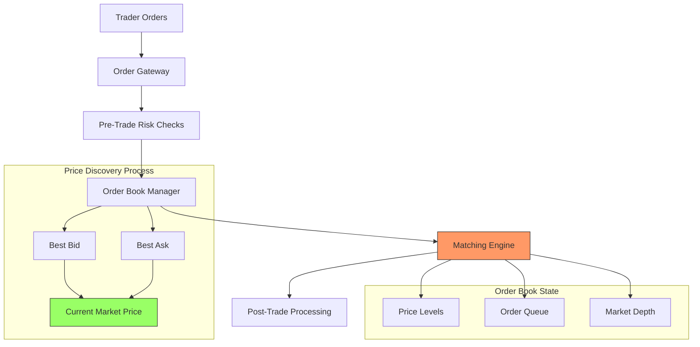
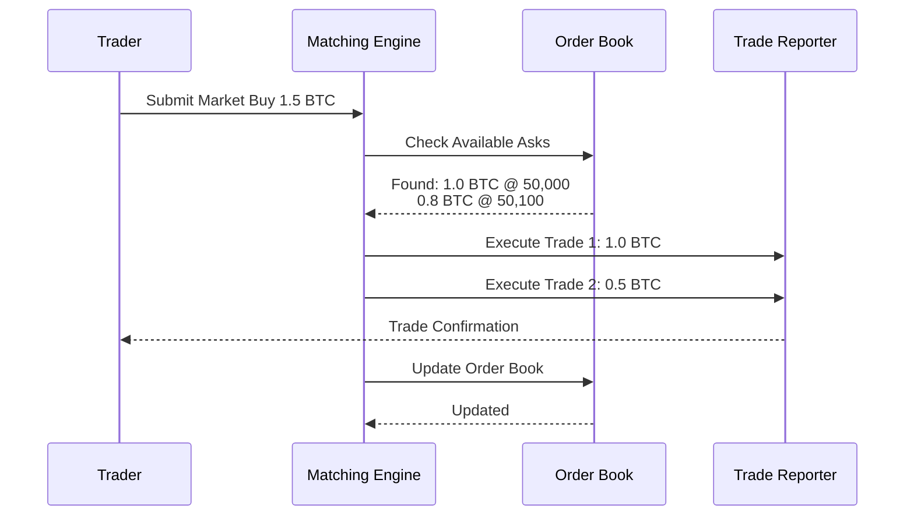
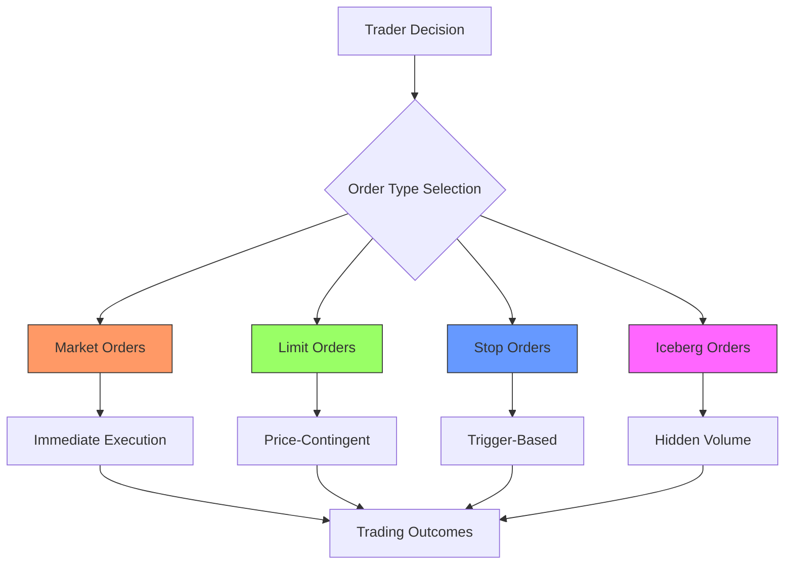

# 1.2.1 Price Discovery and Matching Systems

Imagine a bustling auction house where thousands of buyers and sellers are trying to trade simultaneously, but instead of humans shouting bids, we have a sophisticated electronic system making split-second decisions. This is essentially what modern matching engines do. Let's break down how this complex system works.

First, let me create a visualisation of the core components:



Let's examine how this system works in practice:

## The Order Book: Market's Memory

Think of an order book as a detailed grocery store shelf where instead of products, we have orders to buy and sell. Let me show you a live view of how an order book works:

<figure><figcaption></figcaption></figure>

## The Matching Process: How Orders Become Trades

Let's break down how the matching engine works step by step:

1. Order Receipt and Validation&#x20;

When a new order arrives, the system first validates it:

* Checks order type (market or limit)
* Verifies price and quantity
* Ensures the trader has sufficient funds/assets
* Validates any special conditions (like time-in-force)

2. Price-Time Priority The system uses a principle called "Price-Time Priority" or "FIFO" (First In, First Out):

* Better prices get matched first (higher bids, lower asks)
* At the same price, older orders get priority
* This ensures fairness in the marketplace

3. The Matching Algorithm Here's how a typical match happens:

For a Market Buy Order of 1.5 BTC:

```
Current Order Book:
Sell Orders (Asks)
Price   | Size  | Time
50,000  | 1.0   | 09:01:01
50,100  | 0.8   | 09:01:02
50,200  | 2.0   | 09:01:03

The order would be filled:
1.0 BTC at $50,000 (completely fills first order)
0.5 BTC at $50,100 (partially fills second order)
```

Let me create a visualisation of the matching process:



## Price Discovery: Finding the Fair Value

Price discovery is the process of finding the current fair market value through trading activity.

Let me explain how price discovery works using this housing market example, and then connect it to financial markets:

Imagine you're selling a house in a neighbourhood where similar houses sold for different prices recently. How do you find the "right" price? This process mirrors how financial markets discover prices, just at a much faster pace.

#### Step 1: Initial Price Assessment

* House Market: You look at recent sales of similar houses, the condition of your house, and local market trends
* Financial Market: Traders look at recent trading history, market conditions, and relevant news

#### Step 2: Market Feedback

* House Market: Buyers make offers, some above or below your asking price, based on their research and needs
* Financial Market: Traders place buy and sell orders at various prices based on their analysis and goals

#### Step 3: Price Adjustment

* House Market: You might adjust your asking price based on the interest level and feedback received
* Financial Market: Traders adjust their orders based on market activity and new information

Now, let's see how this applies to a financial market example:

Imagine trading Bitcoin:

1. Starting Point

* Current price: $50,000
* Recent trading range: $49,000 - $51,000
* Average daily volume: 1,000 BTC

2. New Information Arrives

* A major tech company announces they're buying Bitcoin
* Traders react by:
  * Buyers increase their bid prices
  * Sellers pull back their sell orders
  * New buyers enter the market

3. Price Discovery Process

* Initial reaction: Buy orders start hitting higher prices
* Market makers adjust their quotes upward
* Sellers reassess their prices
* A new price level is found where buyers and sellers agree to trade

This process happens continuously in financial markets, but much faster than our house example - often in milliseconds rather than days or weeks.

This house market example illustrates how price discovery works at its core - it's a continuous process where buyers and sellers interact, information flows into the market, and participants adjust their expectations until they find a price where trading can occur. While our housing example happens over days or weeks, modern financial markets operate on these exact same principles, just at an incredibly faster pace and with many more participants.

In financial markets like Spicenet, this process occurs thousands of times per second, with sophisticated electronic systems handling what used to require human negotiation. The core idea remains the same - markets are constantly searching for the "right" price through the interaction of buyers and sellers, just like our house sale example demonstrated.

Now that we understand how prices are discovered in markets, let's explore the next crucial aspect of modern trading systems...

## Special Order Types and Conditions

Modern matching engines handle various order types:

1. Limit Orders
2. Market Orders
3. Stop Orders
4. Iceberg Orders



Think of order types as different tools in a trader's toolbox. Just as a carpenter wouldn't use a hammer for every job, traders use different order types for different situations. Let's explore each one through practical examples:

#### 1. Market Orders&#x20;

The "I Want It Now" Tool Imagine you're at an auction and you shout "I'll take it!" regardless of price. That's essentially what a market order does. Let's see a real example:

Current BTC price: $50,000 Order Book:

* Sell orders: $50,020 (1.5 BTC), $50,050 (0.8 BTC), $50,100 (1.2 BTC)
* Buy orders: $49,980 (1.0 BTC), $49,950 (2.0 BTC), $49,900 (1.5 BTC)

If you place a market buy order for 2 BTC, here's what happens:

1. First 1.5 BTC executes at $50,020
2. Next 0.5 BTC executes at $50,050
3. Your average price: $50,027.50

#### 2. Limit Orders&#x20;

The "My Price or Nothing" Tool Think of this like placing a bid on an online auction site - you set your maximum price and wait. For example:

You place a limit buy order: "Buy 1 BTC at $49,900"

* If price stays above $49,900: Order waits
* If price touches $49,900: Order executes
* If price jumps from $50,000 to $49,800: You still get filled at $49,900

This is perfect for patient traders who want price certainty. It's like telling a real estate agent, "Call me only if you find a house under $500,000."

#### 3. Stop Orders&#x20;

The Safety Net Imagine having an automatic sell trigger if your stock drops too low. This is what stop orders do. Here's how it works:

You own 1 BTC bought at $50,000 You set a stop-loss order at $49,000

* If price stays above $49,000: Nothing happens
* If price drops to $49,000: Order becomes market order
* Order executes at best available price (might be below $49,000)

#### 4. Iceberg Orders

The Stealth Tool Picture trying to sell a huge collection of baseball cards. If everyone knows you have 1,000 cards to sell, they might lower their offers. Instead, you might show only 10 cards at a time. That's what iceberg orders do:

You want to buy 100 BTC Regular order: Shows full 100 BTC (might scare market) Iceberg order: Shows only 5 BTC at a time

* Market sees small order
* As each 5 BTC portion fills, another appears
* Reduces market impact

In practice, traders often combine these orders. For example:

1. Enter with limit order (get good price)
2. Protect with stop order (manage risk)
3. Use iceberg for large sizes (minimise impact)

This variety of order types allows traders to execute their strategies precisely while managing risks and costs. Just as a chef selects different knives for different tasks, successful traders choose the right order type for each situation.

