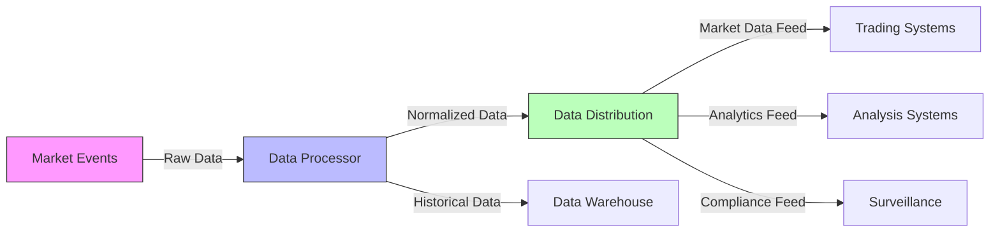

# 1.2.2 Market Data Systems

Market data systems are the nervous system of modern markets. They handle:

Real-time Data Distribution:

* Price updates
* Order book changes
* Trade confirmations
* Market statistics

Let's visualise a market data system:

##
