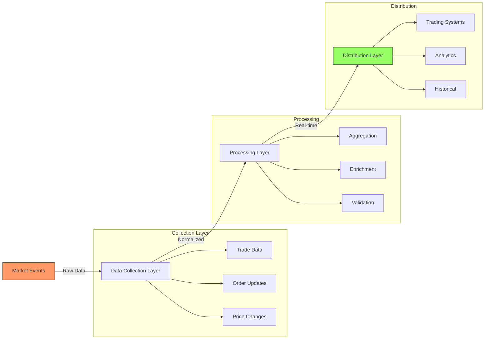

# 1.2.2 Market Data Systems

Market data systems are the nervous system of modern markets. They handle:

Real-time Data Distribution:

* Price updates
* Order book changes
* Trade confirmations
* Market statistics

Let's visualise a market data system:



Imagine you're running a busy restaurant. You need to know:

* What ingredients are in stock (market prices)
* How many orders are coming in (trading volume)
* What customers typically order (market patterns)
* When you're busiest (market activity)

This is similar to how market data systems work, just at a much faster pace and larger scale. Let's break it down:

1. **Data Collection: The Restaurant's Orders**

Just as a restaurant collects orders from tables, phone calls, and delivery apps, market data systems collect information from multiple sources:

Raw Market Events:

* Every trade that happens
* Changes in order books
* Price updates
* Market status changes

Think of this like having a sensor on every table, kitchen station, and entrance in your restaurant, tracking everything that happens.

2. **Data Processing: The Kitchen's Organisation**

Like a kitchen organising incoming orders by priority and type, market data systems process raw data into useful information:

Data Normalisation:

* Standardising formats
* Cleaning incorrect data
* Organising by type
* Adding timestamps

For example, when a trade happens:

```json
Raw Data: "BTC,50000,1.5,BUY"
Processed: {
  asset: "BTC/USD",
  price: 50000.00,
  quantity: 1.50000000,
  side: "BUY",
  timestamp: "2024-01-28T12:00:00.123Z"
}
```

3. **Data Distribution: Serving Different Customers**

Just like different restaurant customers have different needs (dine-in, takeout, delivery), market data serves different users:

Real-time Feeds:

* Traders need immediate price updates
* Risk systems need instant position values
* Compliance needs to monitor trading patterns

Historical Data:

* Analysis teams need past trading patterns
* Risk teams need historical volatility
* Compliance needs audit trails

4. **Data Quality: The Health Inspector**

Like a restaurant maintaining food quality, market data systems ensure data quality through:

Validation Checks:

* Price reasonability
* Trade size limits
* Timestamp sequence
* Data completeness

For example, if Bitcoin suddenly shows a price of $1,000,000, the system flags it for verification.

5. **Real-World Example**

Let's see how this works when a large Bitcoin trade happens:

Initial Event:

* Trader sells 100 BTC at $50,000

Data System Response:

1. Collection Layer:
   * Captures trade details
   * Records order book changes
   * Notes price movement
2. Processing Layer:
   * Calculates new market price
   * Updates volume statistics
   * Checks for unusual activity
3. Distribution Layer:
   * Sends real-time updates to traders
   * Updates risk systems
   * Records in historical database

This happens in milliseconds, allowing everyone in the market to stay synchronised and make informed decisions.

***


Just as market data systems act as the eyes and ears of the market, monitoring and distributing vital information, risk management systems serve as the market's immune system - constantly scanning for threats and protecting against potential dangers. Understanding market data is crucial because it feeds directly into how risk management systems make their decisions.&#x20;


Let's explore how modern markets protect themselves and their participants through sophisticated risk management...
