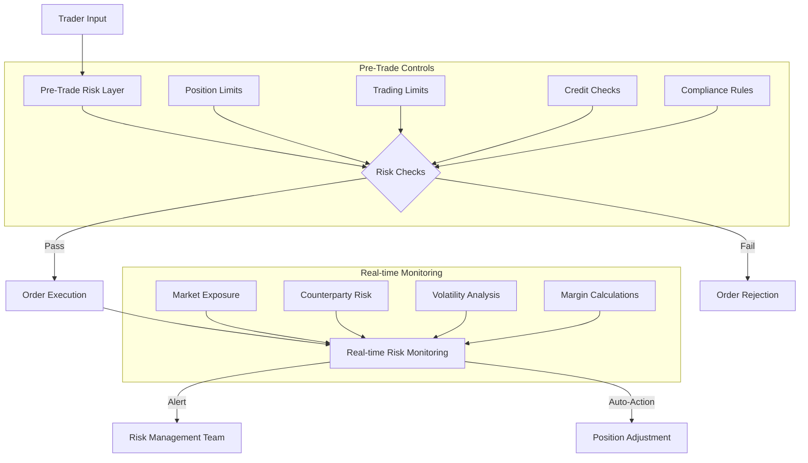

# 1.2.3 Risk Management Systems

Modern markets employ sophisticated risk management systems that operate at multiple levels:

* Pre-Trade Risk Checks, and
* Real-time Risk Monitoring

### Pre-Trade Risk Checks

Think of pre-trade risk checks as a sophisticated bouncer at a nightclub. Before anyone enters (before a trade is executed), several checks occur in milliseconds:

Position Limits: Imagine a trader has $1 million in their account. The system continuously tracks:

* Total position value across all assets
* Maximum allowed position size per asset
* Concentration limits (how much can be in one type of asset)
* Net exposure limits (long vs. short positions)

For example, if a trader already has $800,000 in Bitcoin positions and tries to buy $300,000 more, the system would reject the order if the position limit is $1 million.

#### Trading Limits:&#x20;

These are like speed limits for trading:

* Maximum order size (e.g., can't buy more than 100 BTC in one order)
* Maximum orders per second
* Daily trading volume limits
* Price collar limits (can't place orders too far from market price)

Let me create a visualisation of how trading limits work:

<figure><figcaption></figcaption></figure>

#### Credit Checks:&#x20;

These verify the financial health of traders:

* Available cash balance
* Margin requirements
* Collateral adequacy
* Credit line usage

The system calculates in real-time whether a trader has sufficient resources to execute a trade and maintain required margin levels.
