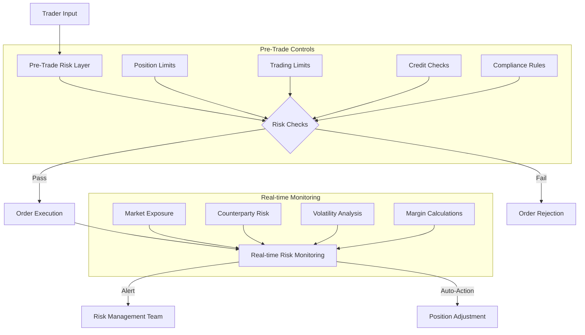

# 1.2.3 Risk Management Systems

Modern markets employ sophisticated risk management systems that operate at multiple levels:

* Pre-Trade Risk Checks, and
* Real-time Risk Monitoring

## **Pre-Trade Risk Checks**

Think of pre-trade risk checks as a sophisticated bouncer at a nightclub. Before anyone enters (before a trade is executed), several checks occur in milliseconds:

Position Limits: Imagine a trader has $1 million in their account. The system continuously tracks:

* Total position value across all assets
* Maximum allowed position size per asset
* Concentration limits (how much can be in one type of asset)
* Net exposure limits (long vs. short positions)

For example, if a trader already has $800,000 in Bitcoin positions and tries to buy $300,000 more, the system would reject the order if the position limit is $1 million.

#### Trading Limits:&#x20;

These are like speed limits for trading:

* Maximum order size (e.g., can't buy more than 100 BTC in one order)
* Maximum orders per second
* Daily trading volume limits
* Price collar limits (can't place orders too far from market price)

Let me create a visualisation of how trading limits work:

<figure><figcaption></figcaption></figure>

#### Credit Checks:&#x20;

These verify the financial health of traders:

* Available cash balance
* Margin requirements
* Collateral adequacy
* Credit line usage

The system calculates in real-time whether a trader has sufficient resources to execute a trade and maintain required margin levels.

## Real-time Risk Monitoring: The Market's Safety Net

Think of real-time risk monitoring as a sophisticated health monitoring system for financial markets - similar to how an intensive care unit monitors patient vital signs. Let's break down each component and understand how they work together.

#### Market Exposure: Understanding Your Financial Footprint

Market exposure is like having a real-time financial weather radar. Imagine you're piloting a ship - you need to know not just where the storms are now, but where they might form and how they could affect your journey.

Here's how market exposure monitoring works:

Value at Risk (VaR) Analysis: Consider a portfolio holding $1 million in Bitcoin and $500,000 in Ethereum. The system continuously asks: "What's the worst loss we could face in the next 24 hours with 95% confidence?" It does this by:

1. Analysing historical price movements
2. Running thousands of possible scenarios (Monte Carlo simulations)
3. Considering correlations between assets
4. Factoring in current market conditions

For example, the system might determine there's a 95% chance the portfolio won't lose more than $100,000 in a day. If this number suddenly jumps to $200,000, risk managers get immediately alerted.

Let me create a visualisation to help understand this:

<figure><figcaption></figcaption></figure>

#### Counterparty Risk: Watching Who You Trade With

Think of counterparty risk like a credit score that updates in real-time. Just as a bank monitors borrowers' ability to repay loans, markets monitor traders' ability to honor their commitments.

The system tracks:

1. Exposure Aggregation:
   * Tracks total exposure to each trading partner
   * Monitors concentration risk (too much exposure to one party)
   * Calculates potential loss if counterparty defaults
2. Settlement Risk:
   * Monitors the gap between trade and settlement
   * Tracks failed or delayed settlements
   * Alerts on unusual settlement patterns

For example, if Trader A has open positions worth $10 million with various counterparties, the system might:

* Set individual counterparty limits (e.g., max $2 million per counterparty)
* Monitor settlement patterns for signs of stress
* Adjust limits based on counterparty credit ratings

#### Volatility Analysis: The Market's Vital Signs

Volatility analysis is like monitoring the market's pulse and blood pressure. It helps predict potential market "health issues" before they become serious problems.

The system performs:

1. Historical Volatility Analysis:
   * Studies recent price movements
   * Identifies volatility patterns
   * Compares current volatility to historical norms
2. Market Impact Analysis:
   * Calculates how large trades might affect prices
   * Estimates liquidity costs
   * Predicts potential market disruptions

Here's a real-world example: If Bitcoin's 30-day volatility suddenly jumps from 3% to 6%, the system would:

* Increase margin requirements
* Reduce position limits
* Trigger more frequent portfolio revaluations
* Alert risk managers to potential market stress

#### Margin Calculations: Your Financial Safety Buffer

Think of margin like a safety deposit on a rental property - it's the buffer that protects the market from trader defaults. The system continuously recalculates required margins based on:

1. Position Risk:
   * Size of positions
   * Market volatility
   * Asset liquidity
   * Portfolio concentration
2. Margin Adequacy:
   * Monitors current margin levels
   * Compares against required margins
   * Triggers warnings when margins get low
   * Initiates protective actions when needed

For example, if a trader has a $1 million Bitcoin position with 10% margin ($100,000):

* If Bitcoin volatility increases, the required margin might increase to 15%
* The system would issue a margin call for an additional $50,000
* If not met, it might begin automatically reducing the position
