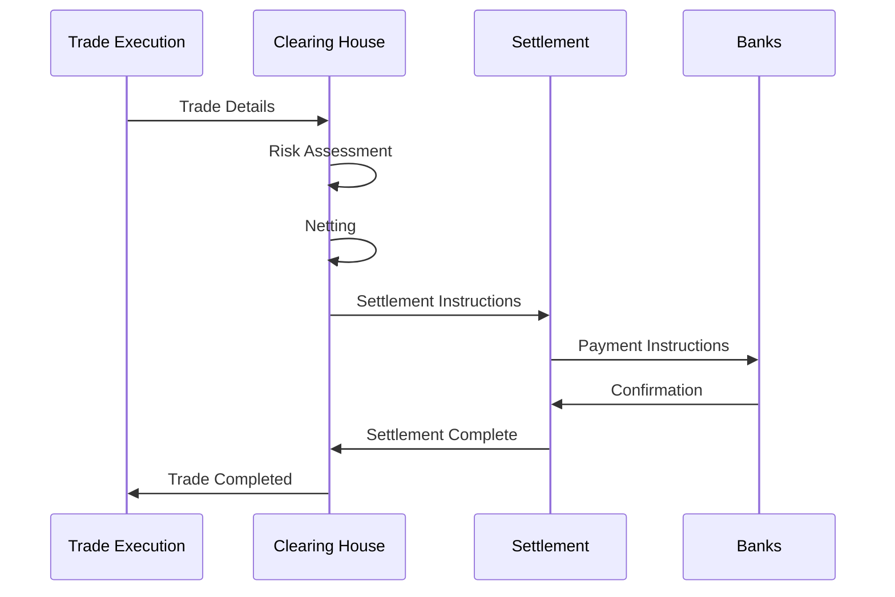

# 1.2.4 Clearing and Settlement

Think of buying a house. After you and the seller agree on a price (like a trade being executed), several important steps happen:

1. A title company verifies ownership (clearing)
2. Your bank confirms funds (clearing)
3. Documents and money are exchanged (settlement)



Let's understand how clearing and settlement works in detail through a practical example:

The Trade: Trader A buys 1 Bitcoin from Trader B at $50,000

Step 1: Trade Clearing Think of clearing as the preparation phase, like when a title company checks property records. Let's see what happens:

Verification Phase:

```
Clearing House Checks:
1. Trader A (Buyer):
   - Has $50,000 available
   - Meets margin requirements
   - No trading restrictions

2. Trader B (Seller):
   - Owns 1 Bitcoin
   - Bitcoin is not pledged elsewhere
   - No trading restrictions
```

Step 2: Trade Netting Netting is like balancing your checkbook at the end of the day. Instead of processing every transaction separately, the clearing house combines all trades between parties:

Example of Netting:

```
Morning Trade: Trader A buys 1 BTC from Trader B at $50,000
Afternoon Trade: Trader A sells 0.5 BTC to Trader B at $51,000

Without Netting:
- Two separate settlements needed
- Total movement: 1.5 BTC and $75,500

After Netting:
- Final Position: Trader A receives 0.5 BTC
- Final Payment: Trader A pays $24,500
- One settlement instead of two
```

Step 3: Settlement Settlement is when ownership actually changes hands. In traditional markets, this process typically takes 1-2 days (T+1 or T+2). Here's why:

Traditional Settlement Process:

```
Day T (Trade Day):
- Trade executed
- Clearing process begins

Day T+1:
- Clearing house confirms all details
- Parties prepare for settlement

Day T+2:
- Assets move from seller to buyer
- Payment moves from buyer to seller
```

In crypto markets, settlement can be much faster:

Crypto Settlement:

```
Time 0: Trade executed
Time 0 + 10 seconds: Transaction submitted to blockchain
Time 0 + 1 minute: Transaction confirmed
Time 0 + 10 minutes: Settlement final
```

Step 4: Settlement Finality This is when the trade becomes irreversible. Let's compare traditional and crypto markets:

Traditional Markets:

```
Requirements for Finality:
1. Clearing house confirmation
2. Bank payment clearing
3. Asset custody transfer
4. Regulatory reporting complete

Typical Time: 1-2 business days
```

Crypto Markets:

```
Requirements for Finality:
1. Required block confirmations reached
2. Smart contract execution complete
3. On-chain verification confirmed

Typical Time: 10-60 minutes
```

This process ensures that:

1. Both parties can fulfill their obligations
2. Risk is properly managed
3. Legal requirements are met
4. Ownership changes are properly recorded

***


As we've seen, netting and settlement help ensure trades are completed correctly, but who makes sure everyone is playing by the rules? This brings us to market surveillance and compliance - think of it as the market's police force and legal system combined. While clearing and settlement handle the mechanics of trading, surveillance and compliance ensure the integrity of the entire trading process, from preventing market manipulation to ensuring all participants follow regulatory requirements.

Just as a bank has security cameras and audit trails to prevent theft and ensure proper behavior, markets need sophisticated surveillance systems to maintain fair and orderly trading. Let's explore how modern markets monitor and enforce their rules...
