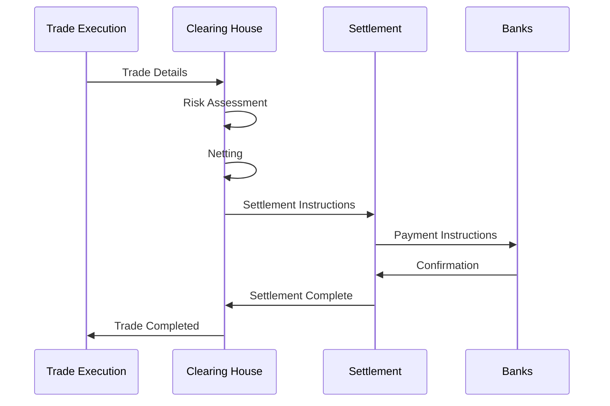

# 1.2.4 Clearing and Settlement

The post-trade infrastructure ensures that trades are completed safely:

Key Functions:

* Trade validation and confirmation
* Position netting
* Collateral management
* Settlement instruction generation
