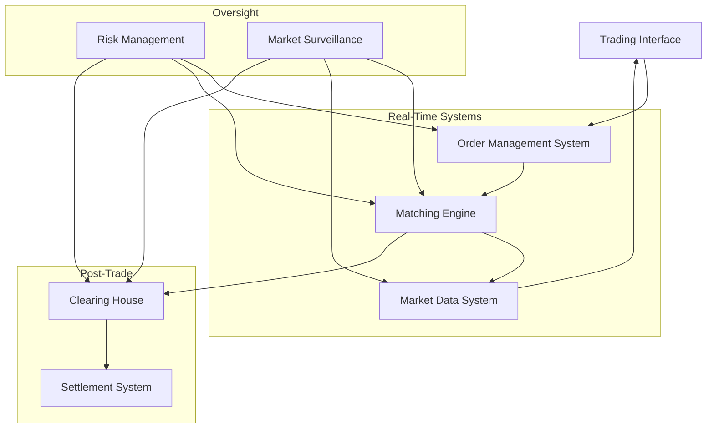

# 1.2 Modern Market Infrastructure

Modern market infrastructure resembles a well-orchestrated symphony, with multiple components working in harmony to enable efficient trading.

First, let me create a visualisation of the core components:

Let's examine each component in detail in the next sections.

