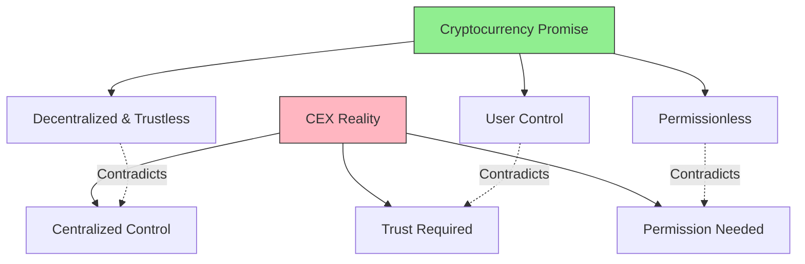

# 1.4 The Rise of DEXs and DeFi

## The Rise of DeFi: Born from Trust Concerns

Imagine you've just learned about Bitcoin - a revolutionary system designed to eliminate intermediaries and give people direct control over their money. You're excited about this vision of financial freedom. But then you encounter a curious contradiction: to actually buy and trade Bitcoin, you need to use centralised exchanges that hold your funds and control your trades.

This was the central irony of early cryptocurrency trading. While Bitcoin itself was decentralised, the primary way to acquire and trade it relied on centralised entities that shared many of the same problems as traditional banks:

This reliance on trust became painfully apparent during several high-profile exchange failures. Even with state-of-the-art security systems, cold storage protocols, and regulatory oversight, the human element remained a point of vulnerability. Whether through malicious intent or operational failures, users discovered that "not your keys, not your coins" wasn't just a catchphrase - it was a harsh reality of centralised systems.

## The Quest for True Decentralisation

As these problems with centralised exchanges became more evident, a question emerged: Could we create trading systems that maintained the core promises of cryptocurrency? Systems where:

* Users never lose custody of their funds
* Anyone could trade without permission
* Every transaction is transparent and verifiable
* No single entity could restrict access or freeze assets

This quest for true decentralisation led to the emergence of decentralised exchanges (DEXs) and the broader DeFi ecosystem. \
\
The early attempts were simple: order books stored directly on blockchains. But these systems were slow and expensive due to blockchain limitations.\
\
Let me explain. \
\
Think of a traditional order book like a busy restaurant host managing dinner reservations. The host has a book where they quickly write down, update, or cancel reservations. It's fast and efficient because it's just one person writing in one book.

Now imagine if every single change to that reservation book had to be:

1. Written down by every waiter in the restaurant
2. Each waiter had to compare their book with everyone else's
3. Everyone had to agree on exactly what the book should look like
4. The restaurant had to pay a fee for every single edit to the book

This is essentially what happens when you try to put an order book directly on a blockchain. Every new order, cancellation, or match needs to:

1. Be processed by every node in the network
2. Reach consensus across all participants
3. Be permanently recorded on the blockchain
4. Pay gas fees for each operation

So even a simple action like placing or canceling a limit order becomes expensive and slow. In busy markets where traders frequently place and cancel orders to find the right price, the costs and delays become prohibitive.\
\
This realization led developers to think differently about the problem. Instead of trying to recreate traditional order books on-chain, they asked: "What if we designed a completely new way of trading that works with the blockchain's strengths rather than fighting its limitations?"

This thinking eventually led to the development of AMMs, which took a radically different approach...
