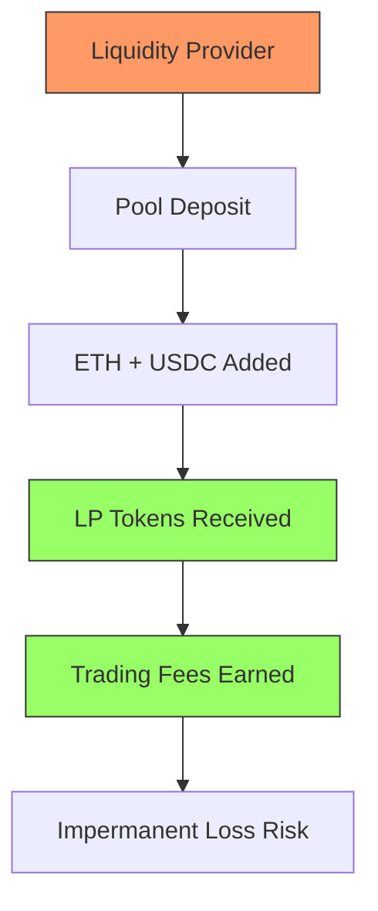

# 1.5.1 AMM Mechanics: Earning, Liquidity, and Price Discovery

Let me explain three crucial aspects of AMMs that form the foundation of how these systems create value and maintain market efficiency. We'll explore each concept through clear examples and build our understanding step by step.

## How Liquidity Providers Earn Returns

Think of being a liquidity provider (LP) like owning a small automated shop in a busy marketplace. When you open your shop (provide liquidity), you stock it with both items customers might want to trade – let's say ETH and USDC.

When traders use your pool, they pay a small fee for each trade – typically 0.3% of the trade value. These fees are automatically added back to the pool, increasing the value of your share. Let's see how this works with real numbers:

Imagine you deposit:

* 10 ETH (worth $30,000)
* 30,000 USDC
* Total value: $60,000

Over a week, your pool processes $1,000,000 in trading volume:

* Fees earned = $1,000,000 × 0.3% = $3,000
* Your earnings = $3,000 × (your pool share)
* If you provided 1% of the pool's liquidity, you earn $30

However, there's a catch called "impermanent loss." If the price of ETH changes significantly, you might have been better off just holding your original assets. This happens because AMMs must maintain their ratios, which can work against you during large price movements.

## The Innovation of Concentrated Liquidity

Traditional AMM pools spread liquidity evenly across all possible price ranges – imagine trying to stock every possible price point in your shop, even ones that will likely never be used. Concentrated liquidity, introduced by Uniswap V3, changed this by letting LPs focus their capital where it's most useful.

Think of it like a department store that allocates more shelf space to popular items and prices. Instead of spreading your $60,000 across every possible ETH price from $1 to $1,000,000, you might concentrate it between $2,800 and $3,200, where most trading actually happens.

This creates:

* Better capital efficiency (your money works harder)
* Higher potential returns (more fees from active price ranges)
* More useful liquidity for traders

But it also requires more active management – you need to adjust your range as market prices move, or your liquidity might become inactive if the price moves outside your chosen range.

## Price Discovery and Oracle Functions

AMMs handle price discovery differently from traditional exchanges. Instead of matching buyers and sellers directly, they act as a price-finding mechanism through their mathematical formulas. Let's understand how this works and why it matters.

Imagine a pool currently pricing ETH at $3,000. If someone believes ETH is worth more, they'll buy from the pool, pushing the price up. If they think it's worth less, they'll sell, pushing the price down. This creates a continuous price discovery process.

However, this system needs to be carefully measured to provide reliable price data to other protocols. This is where Time-Weighted Average Prices (TWAP) come in:

1. The system records pool prices at regular intervals
2. It calculates an average over time (like 30 minutes or 1 hour)
3. This smoothed price becomes a reliable reference for other protocols

For example, if we check prices every minute for an hour:

* Minute 1: $3,000
* Minute 2: $3,010
* Minute 3: $2,995 ...and so on

The TWAP might show $3,002, providing a more stable reference price that's harder to manipulate than any single moment's price.

This system serves two crucial functions:

1. It provides reliable price data for other DeFi protocols
2. It helps protect against price manipulation attempts

***

While understanding how AMM mechanisms enable decentralised trading, liquidity provision, and price discovery is crucial, these systems come with inherent trade-offs that limit their potential. Much like how early automobiles revolutionized transportation but were constrained by the technology of their time, AMMs represented a breakthrough in decentralized finance while facing fundamental limitations.

Just as we saw with liquidity provision, capital often sits idle across wide price ranges, earning minimal fees while waiting for trades that may never come. The price discovery mechanisms, while innovative, struggle to handle large trades without significant slippage, and their oracle functions face latency issues that can impact the entire DeFi ecosystem. Even concentrated liquidity, which aimed to solve capital efficiency, introduced new complexities and risks for liquidity providers.

Let's dive deeper into these challenges in our next section...
