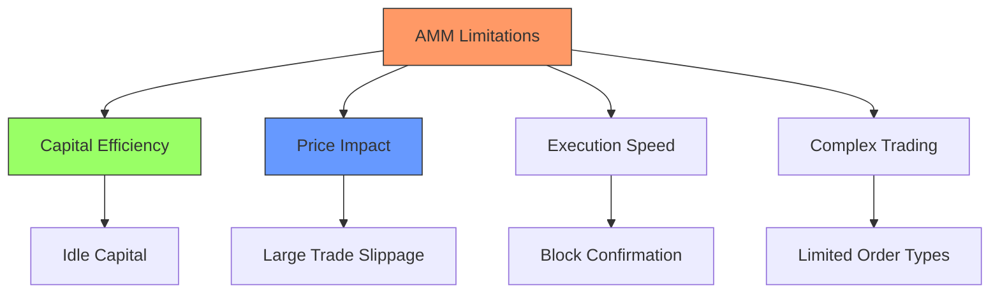

# 1.4.3 The Path to Spicenet: Understanding AMM Limitations

While AMMs revolutionised decentralised trading, they also introduced new challenges and limitations that became more apparent as DeFi grew. Think of these limitations like the growing pains of a city that's expanding rapidly but still using its original infrastructure.

### The Capital Efficiency Problem

Imagine running a currency exchange shop where you need to keep every possible denomination of two currencies, even ones rarely used. That's essentially what AMMs do with liquidity.

When a pool holds ETH and USDC, it must maintain reserves for trading at $2,000, $3,000, $4,000, and every price in between – even though ETH might trade consistently around $3,000. This means if you invest $1 million in a pool:

* Only a small portion actively facilitates trades at current prices
* Most capital sits idle, earning no fees
* Your money is spread too thin, making trades more expensive

When Uniswap V3 tried to solve this with concentrated liquidity, it was like telling shop owners they could focus their inventory around popular exchange rates. However, this created new challenges. Liquidity providers now needed to:

* Constantly monitor price movements
* Adjust their positions frequently (paying gas fees each time)
* Risk missing out on fees if prices moved outside their range

### The Speed Challenge: Why AMMs Can't Keep Up

Traditional exchanges execute trades almost instantly, but AMM trades face several delays. Let's understand why through an example:

Imagine you spot ETH trading at $3,000 and decide to buy. Here's what happens:

1. Block Time Delays: Your transaction enters a pending pool, waiting for the next block. During this time:

* Other traders might see the same opportunity
* The price could change significantly
* Your transaction might sit waiting for 12 seconds (on Ethereum)

2. MEV (Maximal Extractable Value) & Front-running: Think of MEV like someone seeing your trade coming and jumping ahead in line. For example:

* You submit a large buy order for ETH at $3,000
* A bot sees this pending transaction
* They quickly submit their own transaction with higher gas fees
* They buy ETH at $3,000 and sell it to you at $3,010
* You end up paying more than you intended

3. Network Congestion: During busy periods, the network becomes like a traffic jam:

* Gas fees spike (sometimes costing hundreds of dollars)
* Transactions get stuck or fail
* By the time your trade executes, the price has moved against you

### The Price Impact Problem

AMMs use a mathematical formula that automatically raises prices as trade size increases. This creates problems for larger traders:

Consider wanting to buy 100 ETH when the current price is $3,000:

* First few ETH might cost close to $3,000
* Next batch might cost $3,100
* Final batch might cost $3,300
* Average price: $3,133 (4.4% worse than market)

This is like trying to buy all the apples in a small market – each additional purchase drives the price higher, making it impractical for large trades.

### Limitations for Professional Trading

Modern trading requires sophisticated tools that AMMs simply can't provide:

1. Order Types: Imagine wanting to:

* Buy ETH only if it drops to $2,800 (limit order)
* Automatically sell if it falls 10% (stop-loss)
* Buy ETH while simultaneously selling BTC (conditional order) AMMs can't natively support any of these common trading strategies.

2. Risk Management: Professional traders need tools like:

* Position sizing based on portfolio value
* Margin trading for leverage
* Cross-collateral management These features are fundamental to trading but impossible in basic AMM structures.

***

As we've seen, while AMMs revolutionised decentralised trading, their fundamental limitations create significant barriers for widespread DeFi adoption. These challenges – from capital inefficiency to speed constraints, from price impact problems to limited trading capabilities – all point to a crucial need in the ecosystem: a next-generation trading infrastructure that preserves the trustless nature of DeFi while delivering the performance and sophistication of traditional finance.

This is where Spicenet enters the picture, built from the ground up to solve these core limitations. By fundamentally rethinking how decentralised exchanges can operate and brings institutional-grade trading to DeFi without compromising on decentralisation principles.
