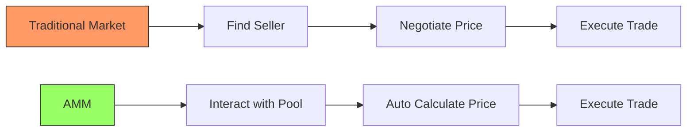

# 1.5 Automated Market Makers (AMMs): Breakthrough In Decentralised Trading

&#x20;Instead of matching buyers and sellers through an order book, AMMs introduced a radically different model that leveraged smart contracts and mathematical formulas to enable permissionless, automated trading.

&#x20;Let's understand how this innovative system works and why it solved the fundamental challenges of decentralised trading.



## Understanding AMMs

Think of a traditional exchange like a busy marketplace where buyers and sellers actively negotiate prices. For every trade to happen, these two parties need to agree on a price, and someone (the exchange) needs to match them together. Now, imagine replacing this entire system with a smart vending machine that can automatically give you any token you want at a mathematically determined price. This is the essence of an AMM.

### The Constant Product Formula: Simple Yet Revolutionary

At the heart of AMMs lies an elegantly simple mathematical concept: the constant product formula. Let's understand how this works in practice:

Think of a pool that contains two assets - let's say ETH and USDC. The pool maintains a simple rule: the product of the amounts of both assets must always remain constant. In mathematical terms:

```
Amount of ETH × Amount of USDC = Constant (k)
```

For example, if a pool has:

* 100 ETH
* 300,000 USDC
* Then k = 100 × 300,000 = 30,000,000

When someone wants to trade with this pool, they don't need to find a counterparty or negotiate a price. Instead, they simply interact with the pool, and the formula automatically determines the price based on how their trade will affect the balance of assets.

### How Trading Works in Practice

Let's say you want to buy 10 ETH from this pool. Here's how the AMM handles your trade:

1. Current State:
   * Pool has 100 ETH and 300,000 USDC
   * k = 30,000,000
2. After you take 10 ETH:
   * Pool will have 90 ETH
   * To maintain k = 30,000,000, we need:
   * 30,000,000 ÷ 90 = 333,333 USDC
3. Therefore:
   * You need to put in: 333,333 - 300,000 = 33,333 USDC
   * This means each ETH costs about 3,333 USDC
   * Notice this is higher than the initial price of 3,000 USDC per ETH

This automatic price adjustment based on trade size, known as "price impact," is a natural mechanism that:

* Protects the pool from being drained
* Encourages price equilibrium
* Ensures there's always liquidity available

### The Innovation: Solving DeFi's Core Challenges

This new model elegantly solved several fundamental problems that plagued early DEX attempts:

1. **Always Available Liquidity** Unlike order books that might have gaps in liquidity at certain price levels, AMMs always provide a price for any trade size (though larger trades face higher price impact).
2. **Gas Efficiency** Instead of paying gas fees for placing, updating, and canceling orders, traders only pay for the actual trade execution.
3. **True Decentralisation** The entire system runs on immutable smart contracts. There's no need for a central entity to match orders or maintain an order book.
4. **Simplicity and Composability** The straightforward nature of AMMs makes them easy to integrate with other DeFi protocols, enabling complex financial applications to be built on top of them.

### Evolution and Innovation

The success of this basic model sparked a wave of innovations in the AMM space. Newer protocols introduced sophisticated features to address various trading scenarios:

1. Balancer introduced pools with multiple assets
2. Curve optimised for stable asset trading
3. Uniswap V3 added concentrated liquidity
4. Other protocols experimented with dynamic fees and customised pricing curves

***

\
Let's understand breifly how AMMs work...
