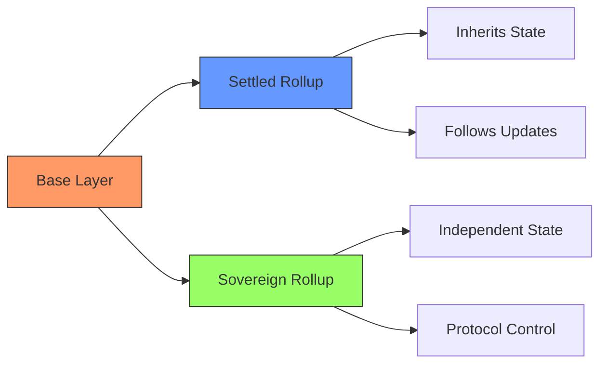

# 2.1 Understanding Spicenet: A Next-Generation Exchange Protocol

Let's explore how Spicenet revolutionizes decentralized trading by fundamentally rethinking exchange architecture. We'll start with a crucial architectural decision that shapes Spicenet's entire design: the choice of sovereign rollups over settled rollups.

