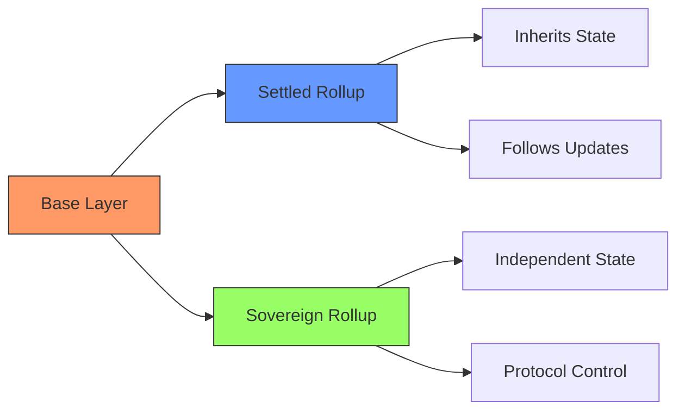

# 2.1 Understanding Spicenet: A Next-Generation Exchange Protocol

Let's explore how Spicenet revolutionises decentralised trading by fundamentally rethinking exchange architecture. We'll start with a crucial architectural decision that shapes Spicenet's entire design: the choice of sovereign rollups over settled rollups.




## The Rollup Decision: Why Sovereignty Matters

Imagine building a city. You could either:

1. Build it as a suburb of an existing city, following all its rules and infrastructure decisions
2. Build an independent city that coordinates with others but makes its own decisions

This analogy helps understand the fundamental difference between settled and sovereign rollups.

## Settled Rollups: The Inherited Constraints

Settled rollups, like Arbitrum and Optimism on Ethereum, are like those suburbs. They must:

1. Wait for the parent chain (Ethereum) to confirm their state updates
2. Follow every protocol upgrade the parent chain makes
3. Deal with parent chain congestion and high fees
4. Accept whatever changes the parent chain's community decides

For example, when Ethereum implemented the Merge, every settled rollup had to adapt their systems accordingly. During high-congestion periods on Ethereum, settled rollups see their costs rise dramatically, impacting their users.

## Sovereign Rollups: The Independent Path

Spicenet chose to be a sovereign rollup on Celestia for fundamental reasons. Think of it like this:

Base Layer (Celestia) provides:

* Data availability (ensuring transaction data is accessible)
* Transaction ordering
* Basic consensus mechanics

While Spicenet maintains control over:

* Its own state management
* Protocol upgrades
* Settlement processes
* Fee structures

This sovereignty enables Spicenet to:

1. Optimise Specifically for Trading:

```
Example: When a large trade comes in
Settled Rollup: Must wait for Ethereum confirmation
Sovereign Rollup: Can confirm trades in milliseconds
```

2. Control Protocol Evolution:

```
When new features are needed:
Settled Rollup: Must work within parent chain constraints
Sovereign Rollup: Can implement optimizations directly
```

3. Maintain Stable Costs:

```
During network congestion:
Settled Rollup: Fees spike with parent chain
Sovereign Rollup: Keeps fees predictable and low
```

