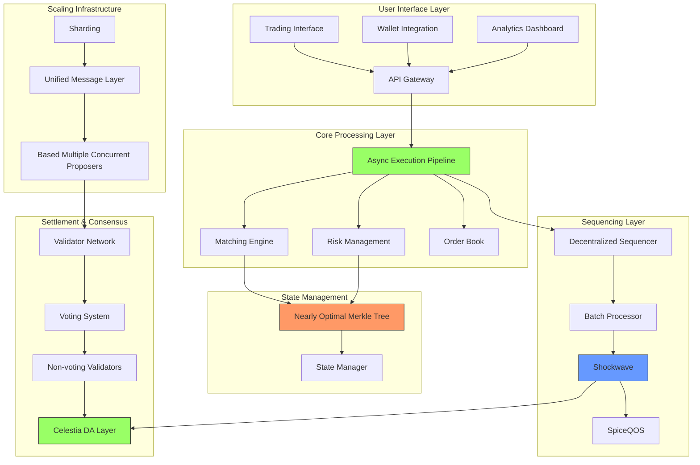

# 2.3 Spicenet's Architecture

When you decide to place a market order to buy 2.5 BTC on Spicenet, you're about to witness a masterpiece of technological orchestration. Your trade will travel through multiple sophisticated systems, each playing a crucial role in ensuring fast, fair, and secure execution. Let's follow this journey from beginning to end, understanding how Spicenet's architecture handles every step.

## The Journey Begins: Entry and Initial Processing

The moment you click "Buy" on your trading interface, your order begins its lightning-fast journey through Spicenet. Think of this first stage like checking in at an airport with a highly sophisticated automated system. Your order first reaches the API Gateway, where it undergoes immediate validation. The system verifies your wallet's signature, checks your available USDC balance of 100,000, and ensures all parameters are correctly formatted. This happens in microseconds, with multiple checks occurring in parallel thanks to the Async Execution Pipeline (AEP).

As your order enters the system, it immediately encounters one of Spicenet's key innovations: the decentralised sequencer running the Deca protocol. Unlike traditional systems where a single entity determines transaction order, Spicenet's sequencers participate in a sophisticated auction system. The current sequencer, selected through a combination of their bid amount and reputation score, receives your trade and begins processing it.

This is where SpiceQOS (Quality of Service) comes into play. Your market order includes a priority fee of 10 units, and the system compares this against the current split threshold, which is dynamically calculated based on network conditions. At this moment, the split is 8 units, meaning your trade qualifies for top-of-batch processing. This isn't just a simple high/low priority designation – it's a sophisticated economic mechanism that ensures fair access to fast execution while preventing spam and maintaining system efficiency.

## The Core of Execution: Matching and State Management

As your 2.5 BTC market buy order enters Spicenet's core systems, it encounters one of the most sophisticated matching engines in decentralised finance. The matching engine doesn't work in isolation – it's part of a carefully orchestrated system where the Nearly Optimal Merkle Tree (NOMT), sharding, and the Unified Message Layer (UML) all work in concert to provide near-instantaneous execution.

Your order first arrives at the BTC/USDC shard, directed there by the UML. This sharding system is crucial – by separating different trading pairs into specialised processing units, Spicenet can handle massive transaction volumes without congestion. Think of it like a large hospital where different departments handle specific types of care, rather than having every doctor try to handle every type of patient.

The matching engine immediately analyses the current order book state. At this moment, there are several sell orders available: 1.0 BTC at $50,000, another 1.0 BTC at $50,100, and 0.5 BTC at $50,200. The matching engine, operating at sub-millisecond speeds, determines that your 2.5 BTC order will need to "walk the book" – taking liquidity at multiple price levels to complete your full order.

This is where NOMT shows its true power. As the matching engine prepares to execute your trade, it needs to check and update multiple state variables – your USDC balance, the sellers' BTC balances, the order book state, and more. In a traditional Merkle tree system, each of these updates would require multiple disk reads and complex hash calculations. But NOMT's innovative design, with its optimised branching and direct path computation, allows these state checks to happen almost instantly.

The system calculates that your trade will require $125,200 USDC (1.0 BTC at $50,000, 1.0 BTC at $50,100, and 0.5 BTC at $50,200). The risk management system, running in parallel thanks to the Async Execution Pipeline, verifies that your 100,000 USDC balance meets the required margin requirements for this trade. It's not just checking your raw balance – it's calculating potential market impact, evaluating your existing positions, and ensuring the trade won't create systemic risk.

As these calculations occur, Shockwave's transaction-level granularity comes into play. Instead of waiting for a full block to be processed, your trade receives an almost immediate pre-confirmation. This is possible because Spicenet's architecture separates transaction ordering from settlement, allowing you to know your trade's status in milliseconds while ensuring proper settlement on Celestia.

