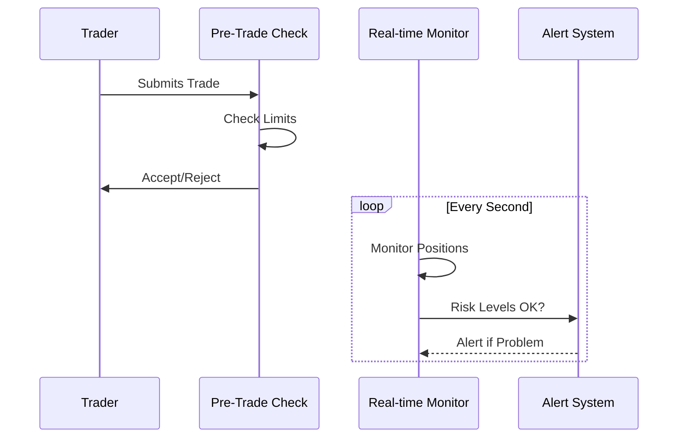

# 1.2.3 Risk Management Systems

Let's start with a simple analogy: Think of a risk management system like a highly sophisticated bouncer at a club. But instead of checking IDs and dress codes, it's checking trades and positions to keep the market safe. Let me show you exactly how this works.




Let me walk you through a real example, step by step:

1. Meet Alice: A New Trader

Alice has:

* Account balance: $100,000
* Current position: 2 Bitcoin (BTC)
* Bitcoin price: $50,000

Let's follow what happens when Alice tries to trade.

2. Pre-Trade Risk Check Example

When Alice tries to buy 2 more Bitcoin, here's exactly what the risk system checks:

Step 1: Position Limit Check

```
Current Position: 2 BTC
Trying to Buy: 2 BTC
New Total Would Be: 4 BTC
Maximum Allowed: 5 BTC
Result: PASS (4 BTC is less than 5 BTC limit)
```

Step 2: Value Check

```
Current Position Value: 2 BTC × $50,000 = $100,000
New Position Value: 4 BTC × $50,000 = $200,000
Account Balance: $100,000
Maximum Allowed Value: $100,000 × 80% = $80,000
Result: FAIL (New value $200,000 exceeds maximum $80,000)
```

The trade is rejected because while the position size is okay, the total value would be too high for Alice's account.

3. Real-Time Monitoring

Now let's say Alice has an existing position. Here's how the system monitors it:

Every Second:

```
Check 1: Position Value
Position: 2 BTC
Current Price: $50,000
Total Value: $100,000
Status: ALERT (Value exceeds 80% of account)

Check 2: Margin Requirements
Required Margin: $20,000
Available Margin: $30,000
Status: OK

Check 3: Profit/Loss
Entry Price: $48,000
Current Price: $50,000
P/L: +$4,000
Status: OK
```

4. What Happens When Problems Are Found

If Bitcoin's price starts falling rapidly:

10:00:00 AM - Price: $50,000

```
Position Value: $100,000
Account Equity: $100,000
Status: OK
```

10:00:01 AM - Price: $48,000

```
Position Value: $96,000
Account Equity: $96,000
Status: WARNING (Price moving rapidly)
```

10:00:02 AM - Price: $45,000

```
Position Value: $90,000
Account Equity: $90,000
Status: ALERT (Consider reducing position)
```

The system would:

1. First send a warning to Alice
2. Start preparing for possible position reduction
3. If price continues falling, begin automatic risk reduction
4. Position Adjustment Example

If the system needs to reduce risk, it calculates exactly how much to reduce:

```
Target Risk Level: $80,000 maximum exposure
Current Exposure: $90,000
Required Reduction: $10,000

Trade Needed:
Sell: $10,000 ÷ $45,000 = 0.22 BTC
New Position After Sell: 1.78 BTC
```

This systematic approach ensures:

* No position gets too large
* Losses are limited
* The market stays healthy

***


After understanding how risk management systems protect the market by monitoring positions and enforcing limits, the next crucial question arises: What happens after a trade is deemed safe and executed? This brings us to clearing and settlement - the essential but often overlooked plumbing of financial markets that ensures trades are completed safely and assets actually change hands.

Think of risk management as the security guard checking if you can enter a store, while clearing and settlement is everything that happens after you decide to buy something - from verifying your payment to ensuring you receive your purchase. Let's explore how modern markets handle this critical post-trade process...
