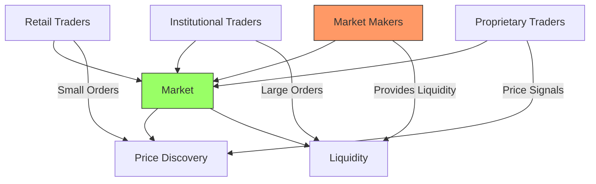
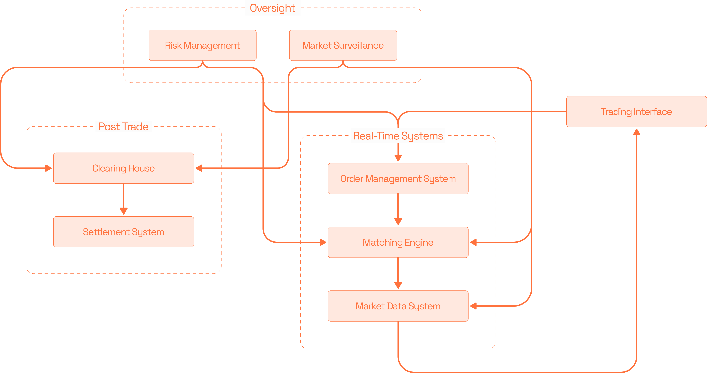

# 1.2 Modern Market & It's Mechanics

Before diving into how modern markets work, we first need to understand who makes these markets function. The key players in market ecosystems - from market makers to institutional traders - each serve specific and crucial roles. Their interactions and activities form the foundation of how markets operate. Let's examine these essential participants and how they work together...



## Market Makers: The Liquidity Providers

Think of market makers like the shopkeepers in a busy marketplace. Just as shopkeepers maintain an inventory of goods to sell, market makers maintain an inventory of securities and provide continuous buy and sell quotes. Here's how they operate:

Basic Market Making:

```
Example: Market Maker in Bitcoin

Bid (willing to buy): $49,900
Ask (willing to sell): $50,000
Spread: $100

When Someone Sells:
- Market maker buys at $49,900
- Adds to inventory
- Updates quotes based on new position

When Someone Buys:
- Market maker sells at $50,000
- Reduces inventory
- Updates quotes based on new position
```

Risk Management:

```
Position Limits:
Max Long Position: 100 BTC
Max Short Position: -100 BTC

Current Position: 50 BTC (Long)
Action: Adjust quotes to encourage selling
- Lower bid price slightly
- Lower ask price slightly
Goal: Return to neutral position
```

## Institutional Traders: The Heavyweights

These are like wholesale buyers in our marketplace analogy. They trade large positions and need special handling:

Large Order Example:

```
Institutional Order:
Buy 1,000 BTC
Current Market Price: $50,000

Problem:
- Order book only shows 100 BTC available
- Showing full order would move price up

Solution:
1. Split into smaller pieces:
   - 10 orders of 100 BTC each
2. Use special order types:
   - Iceberg orders
   - VWAP algorithms
3. Work with market makers:
   - Negotiate block trades
```

## Retail Traders: The Individual Investors

Think of retail traders as regular shoppers in our marketplace. They have different characteristics:

Trading Patterns:

```
Typical Retail Trade:
Size: 0.1 to 1 BTC
Frequency: Less frequent
Strategy: Often trend-following

Advantages:
- More flexible
- Can enter/exit quickly
- No reporting requirements

Challenges:
- Higher costs
- Less information
- Market impact sensitivity
```

## Proprietary Traders: The Specialists

These are like specialised merchants who trade their own capital for profit:

Trading Approach:

```
Strategy Examples:
1. Statistical Arbitrage
   - Find price discrepancies
   - Trade both sides
   - Profit from convergence

2. High-Frequency Trading
   - Very short holding periods
   - High volume of trades
   - Technology-driven

3. Directional Trading
   - Take positions based on views
   - Hold for hours or days
   - Risk management focus
```

## How They Interact:

Let's see how these participants work together in a typical trading scenario:

```
Market Scenario: Large Institutional Order

1. Institution wants to buy 1,000 BTC
2. Market Makers see increased buying interest:
   - Adjust quotes higher
   - Increase inventory to sell

3. Proprietary Traders notice price movement:
   - Some trade momentum
   - Others look for reversal

4. Retail Traders:
   - See price movement
   - May join trend
   - Usually trade after move
```

Now that we understand who the key players are, let's examine exactly how they interact through modern trading platforms. The complex systems enabling order matching, price discovery, risk management, and market data distribution form the technological backbone that makes today's high-speed, high-volume trading possible...


***

## The Mechanics of Modern Market

Modern market infrastructure resembles a well-orchestrated symphony, with multiple components working in harmony to enable efficient trading.

First, let me create a visualisation of the core components:

<figure><figcaption></figcaption></figure>


Let's examine each component in detail in the next sections.

