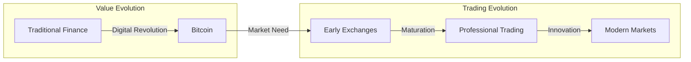
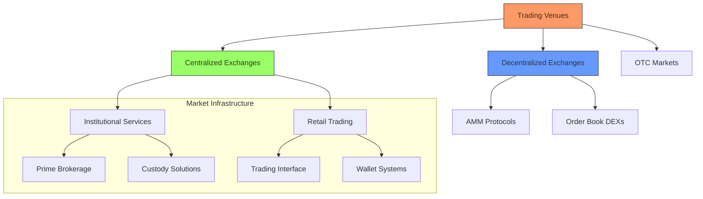
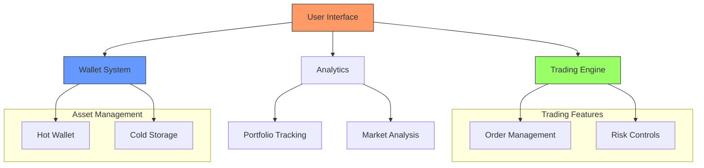

# 1.3 The Crypto Currency Revolution & CEXs

## The Birth of Decentralised Value

In 2009, at the height of the global financial crisis, a revolutionary idea emerged that would transform how we think about money and value. Bitcoin wasn't just another digital payment system; it represented a fundamental shift in how value could be created, stored, and transferred in the digital age.

Think about traditional money - it requires banks to maintain ledgers, governments to issue currency, and countless intermediaries to facilitate transfers. Bitcoin challenged this entire structure by asking a simple but profound question: What if we could create a form of money that was purely digital, yet as scarce and transferable as physical gold?

The solution was ingenious. Instead of relying on banks to maintain ledgers, Bitcoin created a public ledger that everyone could see and verify. Instead of trusting governments to manage the money supply, it established fixed, programmable rules for creating new coins. Most importantly, instead of requiring intermediaries for transfers, it enabled direct peer-to-peer transactions secured by cryptography.

Here's how it worked: When you send Bitcoin, the transaction is broadcast to a network of computers worldwide. These computers (miners) compete to verify and record your transaction in a block, which is then added to the chain of all previous transactions. This process creates an immutable record that everyone can trust without needing to trust anyone in particular.

## From Digital Gold to Trading Asset

As Bitcoin gained value, a new challenge emerged: How could people easily buy and sell this digital asset? The early days of Bitcoin trading were like the Wild West. People would meet on forums, agree on prices, and conduct peer-to-peer trades often based on nothing but trust. This clearly wasn't sustainable for a growing market.

## Enter the First Exchanges

The first cryptocurrency exchanges were remarkably simple compared to today's platforms. Mt. Gox, which began as a trading site for Magic: The Gathering cards, became the first major Bitcoin exchange. It offered basic functionality: you could deposit money, buy Bitcoin, and withdraw either your Bitcoin or your cash.

However, these early exchanges faced enormous challenges. Security was a constant concern - Mt. Gox eventually lost 850,000 Bitcoin to hackers. Banking relationships were unstable, making it difficult to move money in and out. Technical issues were common, with trading engines struggling to handle increasing volume.

The Professional Era Emerges

By 2015, it was clear that cryptocurrency trading needed to grow up. A new generation of exchanges emerged, built with professional trading in mind. These exchanges brought sophisticated features from traditional financial markets to crypto:

* Advanced order types allowed traders to implement complex strategies
* Robust security systems protected against hacks and theft
* Professional market makers provided deeper liquidity
* APIs enabled algorithmic trading
* Cold storage solutions safeguarded customer assets

## The Modern Trading Landscape

Today's cryptocurrency markets bear little resemblance to the early days of Bitcoin. It has evolved into a sophisticated ecosystem that serves everyone from retail traders to large institutions.

## Institutional Infrastructure

The institutional side of cryptocurrency trading has matured significantly. Today's institutional traders have access to sophisticated tools that rival traditional financial markets:

Prime Brokerage Services have become a cornerstone of institutional trading. These services solve several key challenges:

1. Capital Efficiency: Instead of depositing assets at multiple exchanges, institutions can trade across venues using a single pool of capital. This works through a credit system where the prime broker extends trading credit based on the institution's collateral.
2. Settlement Consolidation: Rather than settling hundreds of individual trades, institutions can net their positions across venues and settle once per day. This dramatically reduces operational overhead and counterparty risk.
3. Access Aggregation: Prime brokers provide unified access to multiple liquidity sources - exchanges, OTC desks, and dark pools - through a single API or trading interface.

Custody Solutions have evolved to meet institutional requirements:

1. Security Architecture: Modern custody solutions use sophisticated multi-signature systems, often combining:
   * Hot wallets for active trading
   * Warm wallets for medium-term storage
   * Cold storage for long-term holdings
2. Governance Systems: Institutional custody includes complex approval systems:
   * Multiple approval levels for withdrawals
   * Role-based access control
   * Audit trails for all actions
   * Emergency lockdown procedures

## Retail Trading Platforms

The retail trading experience has been transformed from the early days of basic exchange interfaces. Today's platforms offer sophisticated features while maintaining accessibility for individual traders.

While the Analytics and Trading Engine components may feel familiar from traditional market infrastructure, the Wallet Systems introduce an innovative element that addresses key limitations in the centralised exchange ecosystem. Let's explore why this novel approach to wallet architecture was essential for advancing CEX functionality

### Understanding Modern Trading Wallets: A Two-Tier Security Approach

Modern trading platforms face a critical challenge: how to keep assets both secure and readily available for trading. The solution lies in a carefully designed two-tier wallet system that mirrors how traditional banks manage their cash reserves. Let's understand how this system works and why it's crucial for modern trading.

At the heart of every trading platform's wallet architecture are two distinct components: the hot wallet and cold storage. Think of this like your own personal banking - you keep some money in your checking account for daily use, while the bulk of your savings sits in a more secure, less accessible account. This same principle powers institutional trading systems, just at a much larger scale.

The hot wallet serves as the platform's active treasury, constantly processing trades and managing day-to-day operations. It's like the bank teller's drawer - always open for business, handling deposits and withdrawals, and maintaining just enough funds to meet immediate needs. The hot wallet automatically processes user transactions, manages trading balances, and ensures smooth operation of the trading engine. However, keeping large amounts in a hot wallet would be like storing all your valuables in your front pocket - convenient but risky.

This is where cold storage comes in - the vault of the digital asset world. The majority of assets are stored here, protected by multiple layers of security that make unauthorised access virtually impossible. Unlike the hot wallet, cold storage systems are physically disconnected from the internet, using sophisticated hardware security modules and requiring multiple human approvals for any movement of funds. It's like a bank's main vault - extremely secure but intentionally difficult to access quickly.

What makes this system truly elegant is how it automatically balances security and accessibility. The platform continuously monitors trading activity and automatically moves excess funds from the hot wallet to cold storage, while ensuring the hot wallet maintains enough liquidity for normal operations. Think of it as an intelligent treasury management system that always keeps just enough cash in the register while securing the rest in the vault.

This architecture represents years of evolution in digital asset security, learning from both successes and failures in the industry. When you trade on a modern platform, you're interacting with this sophisticated system that's constantly working to keep your assets both safe and available when you need them.

***

While modern trading infrastructure is impressive in its sophistication, it harbors a fundamental paradox: despite all the technology and automation, it ultimately requires us to trust centralised institutions with our assets. The two-tier wallet system we just discussed, though robust, still places enormous responsibility - and power - in the hands of the trading platform operators.&#x20;

In the next section we will look into how this fundamental paradox sparked a revolution in financial thinking - one that would lay the groundwork for entirely new ways of trading and managing assets.
